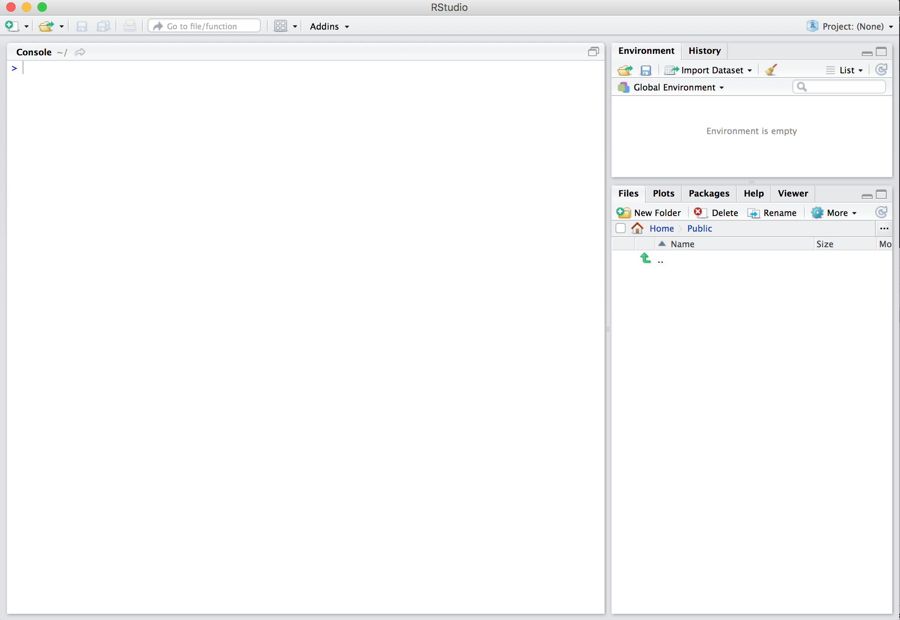

# R et RStudio : les bases {#bases}

Avant de commencer à explorer des données dans R, il y a plusieurs concepts de clé qu'il faut comprendre premier lieu :

1. Que sont R et RStudio ?
2. Comment s'y prend-on pour coder dans R ?
3. Que sont les "packages" ?

Si vous êtes déjà à l'aise avec ces concepts, n'hésitez pas à passer directement à la section \@ref(dataset) ci-dessous, qui présente quelques jeux de données que nous explorerons en détail au cours de ces séances de TP. La plupart de ce chapitre est basé sur les 3 ressources suivantes que je vous encourage à consulter si vous souhaitez obtenir plus de détails :

1. L'ouvrage intitulé [ModernDive](https://moderndive.com/index.html), de Chester Ismay et Albert Y. Kim. Une bonne partie de cet ouvrage est très largement inspirée de cet ouvrage. C'est en anglais, mais c'est un très bon texte d'introduction aux statistiques sous R et RStudio.
2. L'ouvrage intitulé [Getting used to R, RStudio, and R Markdown](https://ismayc.github.io/rbasics-book/) de Chester Ismay, comprend des podcasts (en anglais toujours) que vous pouvez suivre en apprenant.
3. Les tutoriels en ligne de DataCamp. DataCamp est une plateforme de e-learning accessible depuis n'importe quel navigateur internet dont la priorité est l'enseignement des "data sciences". Leurs tutoriels vous aideront à apprendre certains des concepts de développés dans ce livre. Avant d'aller plus loin, rendez-vous sur [le site de DataCamp](https://www.datacamp.com/) et créez vous un compte gratuit.


---

## Que sont R et RStudio

Pour l'ensemble des TP de biométrie 2, j'attends de vous que vous utilisez R *via* RStudio. Les utilisateurs novices confondent souvent les deux. Pour tenter une analogie simple :

- R est le moteur d'une voiture
- RStudio est l'habitacle, le tableau de bord, les pédales

Si vous n'avez pas de moteur, vous n'irez nulle part. En revanche, un moteur sans tableau de bord est difficile à manœuvrer. Il est en effet beaucoup plus simple de faire avancer une voiture depuis l'habitacle, plutôt qu'en actionnant à la main les cables et leviers du moteur.

En l'occurence, R est un langage de programmation capable de produire des graphiques et de réaliser des analyses statistiques, des plus simples au plus complexes. RStudio est un "emballage" qui rend l'utilisation de R plus aisée. RStudio est ce qu'on appelle un IDE : Itegrated Development Environment. On peut utiliser R sans RStudio, mais c'est nettement plus compliqué, nettement moins pratique.


### Installation de R et RStudio

*Si vous travaillez exclusivement sur les ordinateurs de l'Université, vous pouvez passer cette section. Si vous souhaitez utiliser R et RStudio sur votre ordinateur personnel, alors suivez le guide !*

Avant tout, vous devez télécharger et installer R et RStudio, dans cet ordre :

1. [Téléchargez et installez R](https://cran.r-project.org)
 - Note : vous devez installer ce logiciel en premier
 - Cliquez sur le lien de telechargement qui correspond à votre système d'exploitation, puis, sur "base", et suivez les instructions
2. [Téléchargez et installez R](https://www.rstudio.com/products/RStudio/#Desktop)
 - Cliquez sur "Download RStudio Desktop"
 - Choisissez la version gratuite et cliquez sur le lien de télechargement qui correspond à votre système d'exploitation.
 
Pour plus de détails sur la façon de procéder, vous pouvez consulter [cette vidéo](https://campus.datacamp.com/courses/working-with-the-rstudio-ide-part-1/orientation?ex=3) sur le site de DataCamp. Il est possible que vous deviez créer un compte (gratuit) pour accéder à la vidéo.


### Utiliser R depuis RStudio

Puisqu'il est beaucoup plus facile d'utiliser Rstudio pour interagir avec R, nous utiliserons exclusivement l'interface de RStudio. Après l'installation des 2 logiciels, vous disposez de 2 nouveaux logiciels sur votre ordinateur. RStudio ne peut fonctionner sans R, mais nous travaillerons exclusivement dans RStudio :

R: Ne pas ouvrir ceci          |  RStudio: ouvrir ça !
:-------------------------:|:-------------------------:
  |  

À l'université, vous trouverez RStudio dans le menu Windows. Quand vous ouvrez RStudio pour la première fois, vous devriez obtenir une fenêtre qui ressemble à ceci :



Regardez [cette vidéo DataCamp](https://campus.datacamp.com/courses/working-with-the-rstudio-ide-part-1/orientation?ex=5) pour découvrir les différents panneaux de l'application, en particulier la Console dans laquelle nous executerons très bientôt du code R


---

## Comment exécuter du code R ?

Maintenant que vous avez configuré R et RStudio, vous vous demandez probablement "OK. Maintenant, comment utiliser R ?" La première chose à noter est que, contrairement à d'autres logiciels comme Excel, STATA ou SAS qui fournissent des interfaces où tout se fait en cliquant avec sa souris, R est un langage interprété, ce qui signifie que vous devez entrer des commandes R écrites en code R. C'est-à-dire que vous devez **programmer** en R (j'utilise les termes "coder" et "programmer" de manière interchangeable dans ce livre). 

Il ne soit pas nécessaire d'être un programmeur pour utiliser R. Néamnoins il existe un ensemble de concepts de programmation de base que les utilisateurs R doivent comprendre. Par conséquent, bien que ce livre ne soit pas un livre sur la programmation, vous en apprendrez juste assez sur ces concepts de programmation de base nécessaires pour explorer et analyser efficacement des données.

### La console

La façon la plus simle d'interagir avec RStudio (mais pas du tout la meilleure !) consiste à taper directement des commandes que R pourra comprendre dans la Console.

Cliquez dans la console (après le symbole `>`) et tapez ceci, sans oublier de valider en tapant sur la touche `Entrée` :

```{r}
3 + 8
```

Félicitations, vous venez de taper votre première instruction R : vous savez maintenant faire une addition !

### Le répertoire de travail

La première commande que vous devriez connaître quand vous travaillez dans R ou RStudio est la suivante :

```{r, eval=FALSE}
getwd()
```

Si vous tapez cette commande dans la console, RStudio doit vous afficher un emplacement sur votre ordinateur. Cet emplacement est appelé "Répertoire de travail", ou "Working Directory" en anglais (`getwd()` est l'abbréviation de "Get Working Directory").  

Ce répertoire de travail est important : c'est là que seront stockés les tableaux et graphiques que vous déciderez de sauvegarder. C'est là aussi que vous sauvegarderez vos scripts (voir plus bas) qui vous permettront de garder la trace de votre travail et de le reprendre là où vous l'aviez laissé la dernière fois. Enfin, lorsque vous souhaiterez importer des tableaux de données contenus dans des fichiers externes (par exemple, des fichiers Excel), c'est également dans ce répertoire que R tentera de trouver vos données.

Avant d'aller plus loin je vous conseille donc vivement de : 

1. Créer un nouveau dossier intitulé "Biometrie" sur votre espace personnel (généralement, sur le disque "W:" des ordinateurs de l'Université)
2. Indiquez à RStudio que vous souhaitez travailler dans ce nouveau répertoire de travail. Pour cela vous avez 3 solutions au choix :
    1. Dans RStudio, cliquez dans le menu "Session > Set Working Directory > Choose Directory..." puis naviguez jusqu'au dossier que vous venez de créer
    2. Dans le panneau "Files", naviguez jusqu'au dossier "Biometrie" que vous venez de créer, puis cliquez sur le bouton "More > Set As Working Directory"
    3. En ligne de commande, dans la console, utilisez la fonction `setwd()` pour spécifier le chemin de votre nouveau dossier, par exemple :
  
```{r eval=FALSE}
# Attention à bien respecter les majuscules et à utiliser les guillemets.
setwd("W:/Biometrie")
```
  
Il ne vous reste plus qu'à vérifier que le changement a bien été pris en compte en tapant à nouveau `getwd()` dans la console. Attention, vous devez vous assurer d'être dans le bon répertoire de travil **à chaque nouvelle session** !


### Les scripts


### Concepts de base en programmation et terminologie

Pour vous présenter les concepts de base et la terminologie de la programmation dont nous aurons besoin dans R, vous allez suivre les tutoriels en ligne suivants, sur le site de DataCamp. Pour chacun des tutoriels, j'indique une liste des concepts de programmation couverts. Notez que dans ce livre, nous utiliserons une police différente pour distinguer le texte normal et les `commandes-informatiques`.

Il est important de noter que, bien que ces tutoriels sont d’excellentes introductions, une seule lecture est insuffisante pour un apprentissage en profondeur et une rétention à long terme. Les outils ultimes pour l'apprentissage et la rétention à long terme sont "l'apprentissage par la pratique" et "la répétition". Outre les exercices demandés dans DataCamp, que vous devez effectuer directement dans votre navigateur, je vous encourage donc à multiplier les essais, directement dans la console de RStudio pour vous assurer que vous avez bien compris chaque partie.

#### Objets, types, vecteurs, facteurs et tableaux de données

Dans [le cours d'introduction à R](https://www.datacamp.com/community/open-courses/introduction-a-r) sur DataCamp, suivez les chapitres suivants. Au fur et à mesure de votre travail, notez les termes importants et ce à quoi ils font référence.

- [Chapitre 1 : introduction](https://campus.datacamp.com/courses/introduction-a-r/chapitre-1-introduction?ex=1)
    - La console : l'endroit où vous tapez des commandes
    - Les objets : où les valeurs sont stockées, comment assigner des valeurs à des objets
    - Les types de données : entiers, doubles/numériques, charactères et logiques
- [Chapitre 2 : vecteurs](https://campus.datacamp.com/courses/introduction-a-r/chapitre-2-les-vecteurs?ex=1)
    - Les vecteurs : des collections de valeurs du même type.
- [Chapitre 4 : les facteurs](https://campus.datacamp.com/courses/introduction-a-r/chapitre-4-facteurs?ex=1)
    - Des données catégorielles (et non pas *numériques*) représentés dans R sous forme de `factor`s.
- [Chapitre 5 : les jeux de données ou `data.frame`](https://campus.datacamp.com/courses/introduction-a-r/chapitre-5-les-jeux-de-donnees?ex=1)
    - Les `data.frame`s sont similaires aux feuilles de calcul rectangulaires que l'on peut produire dans un tableur. Dans R, ce sont des objets rectangulaires (des tableaux !) contenant des jeux de jeux de données : les lignes correspondent aux observations et les colonnes aux variables décrivant les observations. La plupart du temps, c'es le format de données que nous utiliserons. Plus de détails dans la partie \@ref(dataset).
    

Avant de passer à la suite, il nous reste 2 grandes notions à découvrir dans le domaine du code et de la syntaxe afin de pouvoir travailler efficacement dans R : les opérateurs de comparaison d'une part, et les fonctions d'autre part.

#### Opérateurs de comparaison

Comme leur nom l'indique, ils permettent de comparer des valeurs ou des objets. Les principaux opérateurs de comparaison sont :

* `==` : égale à
* `!=` : différent de
* `>` : supérieur à
* `<` : inférieur à
* `>=` : supérieur ou égal à
* `<=` : inférieur ou égal à

Ainsi, on peut tester si 3 est égal à 5 :
```{r}
3 == 5
```
La réponse est bien entendu `FALSE`. Est-ce que 3 est inférieur à 5 ?
```{r}
3 < 5
```
La réponse est maintenant `TRUE`. Lorsque l'on utilise un opérateur de comparaison, la réponse est toujours soit vrai (`TRUE`), soit faux (`FALSE`).

Il est aussi possible de comparer des chaînes de charactères :
```{r}
"Bonjour" == "Au revoir"
"Bonjour" >= "Au revoir"
```

Manifestement, "Bonjour" est supérieur ou égal à "Au revoir". En fait, R utilise l'ordre alphabétique pour comparer les chaînes de caractères. Puisque dans l'alphabet, le "B" de "Bonjour" arrive après le "A" de "Au revoir", pour R, "Bonjour" est bien supérieur à "Au revoir".

Il est également possible d'utiliser ces opérateurs pour comparer un chiffre et un vecteur :

```{r}
tailles_pop1 <- c(112, 28, 86, 14, 154, 73, 63, 48)
tailles_pop1 > 80
```
Ici, l'opérateur nous permet d'identifier quels éléments du vecteur `taille_pop1` sont supérieurs à 80. Il s'agit des éléments placés en première, troisième et cinquième position.

Il est aussi possible de comparer 2 vecteurs qui contiennent le même nombre d'éléments :
```{r}
tailles_pop2 <- c(114, 27, 38, 91, 54, 83, 33, 68)
tailles_pop1 > tailles_pop2
```

Les comparaisons sont ici faites élément par élément. Ainsi, les observations 2, 3, 5 et 7 du vecteur `tailles_pop1` sont supérieures aux observations 2, 3, 5 et 7 du vecteur ` tailles_pop2` respectivement.

Ces vecteurs de vrais/faux sont très utiles car ils peuvent permettre de compter le nombre d'éléments répondant à une certains condition :
```{r}
sum(tailles_pop1 > tailles_pop2)
```
Lorsque l'on effectue une opération arithmétique (comme le calcul d'une somme ou d'une moyenne) sur un vecteur de vrais/faux, les `TRUE` sont remplacés par `1` et les `FALSE` par `0`. La somme nous indique donc le nombre de vrais dans un vecteur de vrais/faux, et la moyenne nous indique la proportion de vrais :

```{r}
mean(tailles_pop1 > tailles_pop2)
```

**Note** : Attention, si les vecteurs comparés n'ont pas la même taille, un message d'avertissement est affiché :

```{r}
tailles_pop3 <- c(43, 56, 92)
tailles_pop1
tailles_pop3
tailles_pop3 > tailles_pop1
```

Dans un cas comme celui là, R va *recycler* l'objet le plus court, ici `tailles_pop3` pour qu'une comparaison puisse être faite avec chaque élément de l'objet le plus long (ici, `tailles_pop1`). Ainsi, 43 est comparé à 112, 56 est comparé à 28 et 92 est comparé à 86. Puisque `tailles_pop3` ne contient plus d'éléments, ils sont recyclés, dans le même ordre : 43 est comparé à 14, 56 est comparé à 154, et ainsi de suite jusqu'à ce que tous les éléments de `tailles_pop1` aient été passés en revue.

Ce type de recyclage est très risqué car il est difficile de savoir ce qui a été comparé avec quoi. En travaillant avec des tableaux plutôt qu'avec des vecteurs, le problème est généralement évité puisque toutes les colonnes d'un `data.frame` contiennent le même nombre d'éléments.

Dernière chose concernant les opérateurs de comparaison : la question des données manquantes. Dans R les données manquantes sont symbolisées par cette notation : `NA`, abréviation de "Not Available". Le symbole `NaN` est parfois aussi observé lorsque des opérations ont conduit à des indéterminations. Mais c'est plus rare et la plupart du temps, les `NaN`s peuvent être traités comme les `NA`s. L'un des problèmes des données manquantes, est qu'il est nécessaire de prendre des précautions pour réaliser des comparaison les impliquants :
```{r}
3 == NA
```
On s'attend logiquement à ce que 3 ne soit pas considéré comme égal à `NA`, et donc, on s'attend à obtenir `FALSE`. Pourtant, le résultat est `NA`. La comparaison d'un élément quelconque à une donnée manquante fournit toujours une donnée manquante : la comparaison ne peut pas se faire, R n'a donc rien à retourner. C'est également le cas aussi lorsque l'on compare deux valeurs manquantes :
```{r}
NA == NA
```
C'est pourtant assez logique. Imaginons que j'ignore l'âge de Pierre et l'âge de Marie. Il n'y a aucune raison pour que leur âge soit le même, mais il est tout à fait possible qu'il le soit. C'est impossible à déterminer :
```{r}
age_Pierre <- NA
age_Marie <- NA
age_Pierre == age_Marie
```
Mais alors comment faire pour savoir si une valeur est manquante puisqu'on ne peut pas utiliser les opérateurs de comparaison ? On utilise la fonction `is.na()` :
```{r}
is.na(age_Pierre)
is.na(tailles_pop3)
```

D'une façon générale, le point d'exclamation permet de signifier à R que nous souhaitons obtenir le contraire d'une expression :

```{r}
!is.na(age_Pierre)
!is.na(tailles_pop3)
```

Cette fonction nous sera très utile plus tard pour éliminer toutes les lignes d'un tableau contenant des valeurs manquantes.


#### L'utilisation des fonctions


---

## Les packages additionels {#packages}

Une source de confusion importante pour les nouveaux utilisateurs de R est la notion de package. Les packages étendent les fonctionnalités de R en fournissant des fonctions, des données et de la documentation supplémentaires et peuvent être téléchargés gratuitement sur Internet. Ils sont écrits par une communauté mondiale d'utilisateurs R. Par exemple, parmi plus de 13000 packages disponibles à l'heure actuelle, nous utiliseront fréquemment :

* Le package `ggplot2` pour la visualisation des données dans le chapitre \@ref(viz)
* Le package `dplyr` pour les manipuler des tableaux données dans le chapitre \@ref(wrangling)

Il y a deux choses importantes à retenir à propos des packages R :

1. *Installation* : la plupart des packages ne sont pas installés par défaut lorsque vous installez R et RStudio. Vous devez installer un package avant de pouvoir l'utiliser. Une fois que vous l'avez installé, vous n'avez probablement pas besoin de l'installer à nouveau, sauf si vous souhaitez le mettre à jour vers une version plus récente du package. 
1. *Chargement* : les packages ne sont pas chargés automatiquement lorsque vous ouvrez RStudio. Vous devez les charger chaque fois que vous ouvrez RStudio en utilisant la commande `library ()`.

Une bonne analogie pour les packages R : ils sont comme les apps que vous téléchargez sur un téléphone portable :

R : Un nouveau téléphone   |  Packages: Apps qu'on peut telécharger
:-------------------------:|:-------------------------:
  |  


1. R est comme un nouveau téléphone mobile. Il est capable de faire certaines choses lorsque vous l'utilisez pour la première fois, mais il ne sait pas tout faire.
2. Les packages R sont comme les apps que vous pouvez télécharger dans l'App Store et Google Play.
1. Pour utiliser un package, comme pour utiliser Instagram, vous devez :
     1. Le télécharger et l'installer. Vous ne le faites qu'une fois.
     1. Le charger (en d'autres termes, l'ouvrir) en utilisant la commande `library ()`.

Donc, tout comme vous ne pouvez commencer à partager des photos avec vos amis sur Instagram que si vous installez d'abord l'application et que vous l'ouvrez, vous ne pouvez accéder aux données et fonctions d'un package R que si vous installez d'abord le package et le chargez avec la fonction `library()`. Passons en revue ces 2 étapes.


### Installation d'un package

Il y a deux façons d'installer un package. Par example, pour installer le package `ggplot2` :

1. **Le plus simple** : Dans le panneau "File" de Rstudio :
    a) Cliquez sur l'onglet "Packages"
    a) Cliquez sur "Install"
    a) Tapez le nom du package dans le champ "Packages (separate multiple with space or comma):" Pour notre exemple, tapez `ggplot2`
    a) Cliquez "Install"
1. **Métode alternative** : Dans la console, tapez `install.packages("ggplot2")` (vous devez inclure les guillemets).

En procédant de l'une ou l'autre façon, installez également les packages suivants : `tidyverse` et `nycfilghts13`.

**Note** : un package doit être installé une fois seulement, sauf si une version plus récente est disponible et que vous souhaitez mettre à jour ce package.

### Charger un package en mémoire

Après avoir installé un package, vous pouvez le charger en utilisant la fonction `library()`. Par exemple, pour charger `ggplot2` et `dplyr` tapez ceci dans la console :

```{r, eval=FALSE}
library(ggplot2)
library(dplyr)
```


**Note** : Vous devez charger à nouveau chaque package que vous souhaitez utiliser à chaque fois que vous ouvrez une nouvelle session de travail dans RStudio. Ça peut être un peu pénible et c'est une source d'erreur fréquente pour les débutants. Quand vous vouyez un message d'erreur commençant par :

```
Error: could not find function...
```

rappelez-vous que c'est probablement parce que vous tentez d'utiliser une fonction qui fait partie d'un package que vous n'avez pas chargé. Pour corriger l'erreur, il suffit donc de charger le package approprié avec la commande `library()`.


