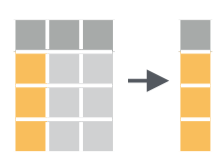

# Tripatouiller les données avec `dplyr` {#wrangling}

## Pré-requis 

Nous abordons ici une étape essentielle de toute analyse de données : la manipulation de tableaux, la sélection de lignes, de colonnes, la création de nouvelles variables, etc. Bien souvent, les données brutes que nous importons dans R ne sont pas utiles en l'état. Il nous faut parfois sélectionner seulement certaines lignes pour travailler sur une petite partie du jeu de données. Il nous faut parfois modifier des variables existantes (pour modifier les unités par exemple) ou en créer de nouvelles à partir des variables existantes. Nous avons aussi très souvent besoin de constituer des groupes et d'obtenir des statistiques descriptives pour chaque groupe (moyenne, écart-type, erreur type, etc). Nous verrons dans ce chapitre comment faire tout cela grâce au package `dplyr` qui fournit un cadre cohérent et des fonctions simples permettant d'effectuer tous les tripatouillages de données dont nous pourrons avoir besoin.

Dans ce chapitre, nous aurons besoin des packages suivants :
```{r}
library(dplyr)
library(ggplot2)
library(nycflights13)
```

```{r include=FALSE}
library(tidyverse)
```


----

## Le pipe `%>%`

Avant d'entrer dans le vif du sujet, je souhaite introduire ici la notion de "pipe" (prononcer à l'anglo-saxonne). Le pipe est un opérateur que nous avons déjà vu apparaître à plusieurs reprises dans les chapitres précédents sans expliquer son fonctionnement.

Le pipe, noté `%>%`, peut être obtenu en pressant les touches `ctrl + shift + M` de votre clavier. Il permet d'enchaîner logiquement des actions les unes à la suite des autres. Globalement, le pipe prend l'objet situé à sa gauche, et le transmet à la fonction situé à sa droite. En d'autres termes, les 2 expressions suivantes sont strictement équivalentes :

```{r eval = FALSE}
# Ici, "f" est une fonction quelconque, "x" et "y" sont 2 objets dont la fonction a besoin.

# Il s'agit d'un exemple fictif : ne tapez pas ceci dans votre script !
f(x, y)
x %>% f(y)
```


Travailler avec le pipe est très intéressant car toutes les fonctions de `dplyr` que nous allons décrire ensuite sont construites autour de la même syntaxe : on leur fournit un `data.frame` (ou encore mieux, un `tibble`), elles effectuent une opération et renvoient un nouveau `data.frame` (ou un nouveau `tibble`). Il est ainsi possible de créer des groupes de commandes cohérentes qui permettent, grâce à l'enchaînement d'étapes simples, d'aboutir à des résultats complexes.

De la même façon que le `+` permet d'ajouter une couche supplémentaire à un graphique `ggplot2`, le pipe `%>%` permet d'ajouter une opération supplémentaire dans un groupe de commandes.

Pour reprendre un exemple de la section \@ref(clouds) sur les nuages de points, nous avions commencé par créer un objet nommé `alaska_flights` à partir de l'objet `flights` :

```{r, tidy = FALSE}
alaska_flights <- flights %>%
  filter(carrier == "AS")
```

Nous avions ensuite créé notre premier nuage de points avec ce code :

```{r tidy=FALSE, warning = FALSE, eval=FALSE}
ggplot(data = alaska_flights, mapping = aes(x = dep_delay, y = arr_delay)) + 
  geom_point()
```

Nous savons maintenant qu'il n'est pas indispensable de faire figurer le nom des arguments `data = ` et `mapping = `. Mais nous pouvons aller plus loin. En fait, il n'était même pas nécessaire de créer l'objet `alaska_flights` : nous aurions pu utiliser le pipe pour enchaîner les étapes suivantes :

1. On prend le tableau `flights`, *puis*
2. On filtre les données pour ne retenir que la compagnie aérienne `AS`, *puis*
3. On réalise le graphique

Voilà comment traduire cela avec le pipe :

```{r tidy=FALSE, warning = FALSE, fig.cap="Notre premier graphique, produit grâce au pipe"}
flights %>% 
  filter(carrier == "AS") %>% 
  ggplot(aes(x = dep_delay, y = arr_delay)) + 
    geom_point()
```

Notez bien qu'ici, aucun objet intermédiaire n'a été créé. Notez également que le premier argument de la fonction `ggplot()` a disparu : le pipe a fourni automatiquement à `ggplot()` les données générées au préalable (les données `flights` filtrées grâce à la fonction `filter()`).

Comme pour le `+` de `ggplot2`, il est conseillé de placer un seul pipe par ligne, de le placer en fin de ligne et de revenir à la ligne pour préciser l'étape suivante.

Toutes les commandes que nous utiliserons à partir de maintenant reposeront sur le pipe puisqu'il permet de rendre le code plus lisible.


----

## Les verbes du tripatouillage de données

Nous allons ici nous concentrer sur les fonctions les plus couramment utilisées pour manipuler et résumer des données. Nous verrons 6 verbes principaux, chacun correspondant à une fonction précise de `dplyr`. Chaque section de ce chapitre sera consacrée à la présentation d'un exemple utilisant un ou plusieurs de ces verbes.

Les 6 verbes sont :

1. `filter()` : choisir des lignes dans un tableau à partir de conditions spécifiques (filtrer).
2. `arrange()` : trie les lignes d'un tableau selon un ou plusieurs critères (arranger).
3. `select()` : sélectionner des colonnes d'un tableau.
4. `mutate()` : créer de nouvelles variables en transformant et combinant des variables existantes (muter).
5. `summarise()` : calculer des résumés statistiques des données (résumer). Souvent utilisé en combinaison avec `group_by()`, qu permet de constituer des groupes au sein des données.
6. `join()` : associer, fusionner 2 `data.frame`s en faisant correspondre les éléments d'une colonne commune entre les 2 tableaux (joindre). Il y a de nombreuses façons de joindre des tableaux. Nous nous contenterons d'examiner les fonctions `left_join()` et `inner_join()`.

Toutes ces fonctions, tous ces verbes, sont utilisés de la mêma façon : on prend un `data.frame`, grâce au pipe, on le transmet à l'une de ces fonctions dont on précise les arguments entre parenthèses, la fonction nous renvoie un nouveau tableau modifié. Évidemment, on peut enchaîner les actions pour modifier plusieurs fois le même tableau, c'est tout l'intérêt du pipe.

Enfin, gardez en tête qu'il existe beaucoup plus de fonctions dans `dplyr` que les 6 que nous allons détailler ici. Nous verrons parfois quelques variantes, mais globalement, maîtriser ces 6 fonctions simples devrait vous permettre de conduire une très large gamme de manipulations de données, et ainsi vous faciliter la vie pour la production de graphiques et l'analyse statistique de vos données.


----

## Filtrer des lignes avec `filter()`

### Principe

```{r, filterfig, echo = FALSE, out.width='50%', fig.align='center', fig.cap="Schéma de la fonction `filter()` tiré de la 'cheatsheet' de `dplyr` et `tidyr`"}
knitr::include_graphics('images/filter.png')
```

Comme son nom l'indique, `filter()` permet de filtrer des lignes en spécifiant un ou des critères de tri portant sur une ou plusieurs variables. Nous avons déjà utilisé cette fonction à plusieurs reprises pour créer les jeux de données `alaska_flights` et `small_weather` :

```{r tidy = FALSE, eval = FALSE}
alaska_flights <- flights %>% 
  filter(carrier == "AS")
```

```{r tidy = FALSE, eval = FALSE}
small_weather <- weather %>% 
  filter(origin == "EWR",
         month == 1,
         day <= 15)
```

Dans les 2 cas, la première ligne de code nous permet :

1. d'indiquer le nom du nouvel objet dans lequel les données modifiées seront stockées (`alaska_flights` et `small-weather`)
2. d'indiquer de quel objet les données doivent être extraites (`flights` et `weather`)
3. de passer cet objet à la fonction suivante avec un pipe `%>%`

Le premier argument de la fonction `filter()` doit être le nom d'un `data.frame` ou d'un `tibble`. Ici, puisque nous utilisons le pipe, il est inutile de spécifier cet argument : c'est ce qui est placé à gauche du pipe qui est utilisé comme premier argument de la fonction `filter()`. Les arguments suivants constituent la ou les conditions qui doivent être respectées par les lignes du tableau de départ afin d'être intégrées au nouveau tableau de données.

### Exercice

Dans la section \@ref(View), nous avons utilisé la fonction `View` et l'application manuelle de filtres pour déterminer combien de vols avaient quitté l'aéroport JFK le 12 février 2013. En utilisant la fonction `filter()`, créez un objet nommé `JFK_12fev` qui contiendra les données de ces vols.

```{r include=FALSE}
JFK_12fev <- flights %>% 
  filter(origin == "JFK",
         month == 2,
         day == 12)
JFK_12fev
```

Vérifiez que cet objet contient bien `r nrow(JFK_12fev)` lignes.

### Les conditions logiques

Dans la section \@ref(comparaison), nous avons présenté en détail le fonctionnement des opérateurs de comparaison dans R. Relisez cette section si vous ne savez plus de quoi il s'agit. Les opérateurs de comparaison permettent de vérifier l'égalité ou l'inégalité entre des éléments. Ils renvoient `TRUE` ou `FALSE` et seront particulièrement utiles pour filtrer des lignes dans un tableau. Comme indiqué dans la section \@ref(comparaison), voici la liste des opérateurs de comparaison usuels :

* `==` : égal à
* `!=` : différent de
* `>` : supérieur à
* `<` : inférieur à
* `>=` : supérieur ou égal à
* `<=` : inférieur ou égal à

À cette liste, nous pouvons ajouter quelques éléments utiles :

* `is.na()` : renvoie `TRUE` en cas de données manquantes.
* `!` : permet de tester le contraire d'une expression logique. Par exemple `!is.na()` renvoie `TRUE` s'il n'y a pas de données manquantes.
* `%in%` : permet de tester si l'élément de gauche est contenu dans la série d'éléments fournie à droite. Par exemple `2 %in% 1:5` renvoie `TRUE`, mais `2 %in% 5:10` renvoie `FALSE`.
* `|` : opérateur logique `OU`. Permet de tester qu'une condition `OU` une autre est remplie.
* `&` : opérateur logique `ET`. Permet de tester qu'une condition `ET` une autre sont remplies.

Voyons comment utiliser ces opérateurs avec la fonction `filter()`.

Dans le tableau `flights`, tous les vols prévus ont-ils effectivement décollé ? Une bonne façon de le savoir est de regarder si, pour la variable `dep_time` (heure de décollage), des données manquantes sont présentes :

```{r, tidy=FALSE}
flights %>% 
  filter(is.na(dep_time))
```

```{r, tidy=FALSE, include=FALSE}
naflights <- flights %>% 
  filter(is.na(dep_time))
```

Seules les lignes contenant `NA` dans la colonne `dep_time` sont retenues. Il y a donc `r nrow(naflights)` vols qui n'ont finalement pas décollé. 

Dans le même ordre d'idée, y a t-il des vols qui ont décollé mais qui ne sont pas arrivés à destination ? Là encore, une façon d'obtenir cette information est de sélectionner les vols qui ont décollé (donc pour lesquels l'heure de décollage n'est pas manquante), mais pour lesquels l'heure d'atterrissage est manquante :

```{r, tidy=FALSE}
flights %>% 
  filter(!is.na(dep_time),
         is.na(arr_time))
```

Notez l'utilisation du `!` pour la première condition. Nous récupérons ici les lignes pour lesquelles `dep_time` n'est pas `NA` et pour lesquelles `arr_time` est `NA`. Seules les lignes qui respectent cette double condition sont retenues. Cette syntaxe est équivalente à :

```{r, tidy=FALSE}
flights %>% 
  filter(!is.na(dep_time) & is.na(arr_time))
```

```{r, tidy=FALSE, include=FALSE}
flights_annul <- flights %>% 
  filter(!is.na(dep_time) & is.na(arr_time))
```

Dans la fonction `filter()`, séparer plusieurs conditions par des virgules signifie que seules les lignes qui remplissent toutes les conditions seront retenues. C'est donc l'équivalent du `ET` logique.

Il y a donc `r nrow(flights_annul)` vols qui ne sont pas arrivés à destination (soit moins de 0,2% des vols au départ de New York en 2013). Selon vous, quelles raisons peuvent expliquer qu'un vol qui a décollé n'ait pas d'heure d'atterrissage ?

Enfin, pour illustrer l'utilisation de `|` (le `OU` logique) et de `%in%`, imaginons que nous souhaitions extraire les informations des vols ayant quitté l'aéroport `JFK` à destination d'Atlanta, Géorgie (`ATL`) et de Seatle, Washington (`SEA`), aux mois d'octobre, novembre et décembre :

```{r, tidy = FALSE}
atl_sea_fall <- flights %>% 
  filter(origin == "JFK", 
         dest == "ATL" | dest == "SEA", 
         month >= 10)
atl_sea_fall
```

Examinez ce tableau avec `View()` pour vérifier que la variable `dest` contient bien uniquement les codes `ATL` et `SEA` correspondant aux 2 aéroports qui nous intéressent. Nous avons extrait ici les vols à destination d'Atlanta **et** Seatle, pourtant, il nous a fallu utiliser le `OU` logique. Car chaque vol n'a qu'une unique destination, or nous souhaitons récupérer toutes les lignes pour lesquelles la destination est soit `ATL`, soit `SEA` (l'une **ou** l'autre).

Une autre solution pour obtenir le même tableau est de remplacer l'expression contenant `|` par une expression contenant `%in%` :

```{r, tidy = FALSE}
atl_sea_fall2 <- flights %>% 
  filter(origin == "JFK", 
         dest %in% c("ATL", "SEA"), 
         month >= 10)
atl_sea_fall2
```

Ici, toutes les lignes du tableau dont la variable `dest` est égale à un élément du vecteur `c("ATL", "SEA")` sont retenues. L'utilisation du `OU` logique eput être source d'erreur. Je préfère donc utiliser `%in%` qui me semble plus parlant. La fonction `identical()` nous confirme que les deux façons de faire produisent exactement le même résultat, libre à vous de rpivilégier la méthode qui vous convient le mieux :

```{r}
identical(atl_sea_fall, atl_sea_fall2)
```


----

## Créer des résumés avec `summarise()` et `group_by()`

### Principe de la fonction `summarise()`

```{r, summarisefig, echo = FALSE, out.width='70%', fig.align='center'}
knitr::include_graphics('images/summarizearrow.png')
```

```{r, summarisefig2, echo = FALSE, out.width='40%', fig.align='center', fig.cap="Schéma de la fonction `summarise()` tiré de la 'cheatsheet' de `dplyr` et `tidyr`"}

```

La figure \@ref(fig:summarisefig2) ci-dessus indique comment fonctionne la fonction `summarise()` : elle prend plusieurs valeurs (potentiellement, un très grand nombre) et les réduit à une unique valeur qui les résume. Lorsque l'on applique cette démarche à plusieurs colonnes d'un tableau, on obtient un tableau qui ne contient plus qu'une unique ligne de résumé.

La valeur qui résume les données est choisie par l'utilisateur. Il peut s'agir par exemple d'un calcul moyenne ou de variance, il peut s'agir de calculer une somme, ou d'extraire la valeur maximale ou minimale, ou encore, il peut tout simplement s'agir de déterminer un nombre d'observations.

Ainsi, pour connaître la température moyenne et l'écart-type des températures dans les aéroports de New York, il suffit d'utiliser le tableau `weather` et sa variable `temp` que nous avons déjà utilisés dans les chapitres précédents :

```{r, tidy = FALSE}
weather %>% 
  summarise(moyenne = mean(temp),
            ecart_type = sd(temp))
```

Les fonctions `mean()` et `sd()` permettent de calculer une moyenne et un écart-type respectivement. Ici, les valeurs retournées sont `NA` car une valeur de température est manquante :

```{r, tidy=FALSE}
weather %>% 
  filter(is.na(temp))
```

Pour obtenir les valeurs souhaitées, il faut indiquer à R d'exclure les valeurs manquantes lors des calculs de moyenne et écart-types :


```{r, tidy = FALSE}
weather %>% 
  summarise(moyenne = mean(temp, na.rm = TRUE),
            ecart_type = sd(temp, na.rm = TRUE))
```


```{r, tidy = FALSE, include = FALSE}
temper <- weather %>% 
  summarise(moyenne = mean(temp, na.rm = TRUE),
            ecart_type = sd(temp, na.rm = TRUE))
```

La température moyenne est donc de `r round(temper[1,1],1)` degrés Farenheit et l'écart-type vaut `r round(temper[1,2],1)` degrés Farenheit.


### Intérêt de la fonction `group_by()`

La fonction devient particulièrement puissante lorsqu'elle est combinée avec la fonction `group_by()` :

```{r, groupby, echo = FALSE, out.width='65%', fig.align='center', fig.cap="Fonctionnement de `group_by()` travaillant de concert avec `summarise()`, tiré de la 'cheatsheet' de `dplyr` et `tidyr`"}

```

Comme son nom l'indique, la fonction `group_by()` permet de créer des sous-groupes dans un tableau, afin que le résumé des données soit calculé pour chacun des sous-groupes plutôt que sur l'ensemble du tableau. En ce sens, son fonctionnement est analogue à celui des `facet`s de `ggplot2` qui permettent de scinder les données d'un graphique en plusieurs sous-groupes.

Pour revenir à l'exemple des températures, imaginons que nous souhaitions calculer les températures moyennes et les écart-types pour chaque mois de l'année. Voilà comment procéder :

```{r, tidy = FALSE}
weather %>% 
  group_by(month) %>% 
  summarise(moyenne = mean(temp, na.rm = TRUE),
            ecart_type = sd(temp, na.rm = TRUE))
```

Ici, les étapes sont les suivantes :

1. On prend le tableau `weather`, *puis*
2. On groupe les données selon la variable `month`, *puis*
3. On résume les données groupées sous la forme de moyennes et d'écart-types

Nous pouvons aller plus loin. Ajoutons à ce résumé 2 variables supplémentaires : le nombre de mesures et l'**erreur standard** (notée $se$), qui peut être calculée de la façon suivante : 

$$se \approx \frac{s}{\sqrt{n}}$$

avec $s$, l'écart-type de l'échantillon et $n$, la taille de l'échantillon. Cette grandeur est très importante en statistique puisqu'elle nous permet de quantifier **l'imprécision** de la moyenne. Elle intervient d'ailleurs dans le calcul de l'intervalle de confiance de la moyenne d'un échantillon. Nous allons donc calculer ici ces résumés, et nous donnerons un nom au tableau créé pour ouvoir ré-utiliser ces statistiques descriptives :

```{r, tidy = FALSE}
monthly_temp <- weather %>% 
  group_by(month) %>% 
  summarise(moyenne = mean(temp, na.rm = TRUE),
            ecart_type = sd(temp, na.rm = TRUE),
            nb_obs = n(),
            erreur_std = ecart_type / sqrt(nb_obs))
monthly_temp
```

Vous constatez ici que nous avons 4 statistiques descriptives pour chaque mois de l'année. Deux choses sont importantes à retenir ici : 

1. on peut obtenir le nombre d'observations dans chaque sous-groupe d'un tableau groupé en utilisant la fonction `n()`. Cette fonction n'a besoin d'aucun argument : elle détermine automatiquement la taille des groupes créés par `group_by()`.
2. on peut créer de nouvelles variables en utilisant le nom de variables créées auparavant. Ainsi, nous avons créé la variable `erreur_std` en utilisant deux variables créées au préalable : `ecart-type` et `nb_obs`

### Ajouter des barres d'erreurs sur un graphique

Ce jeu de données contient donc les données nécessaires pour nous permettre de visualiser sur un graphique l'évolution des températures moyennes enregistrées dans les 3 aéroports de New York en 2013. Outre les température moyennes, nous devons faire figurer l'imprécision des estimations de moyenne avec des barres d'erreur (à l'aide de la fonction `geom_inerange()`). Comme expliqué plus haut, l'imprécision des moyennes calculées est estimée grâce à l'erreur standard. Toutefois, ici, les imprécisions sont tellement faibles que les barres d'erreurs resteront invisibles :

```{r errorbars, tidy=FALSE, warning = FALSE, fig.cap="Évolution des températures moyenne dans 3 aéroports de New York en 2013"}
monthly_temp %>% 
  ggplot(aes(x = factor(month), y = moyenne, group = 1)) +
    geom_line() + 
    geom_point() +
    geom_linerange(aes(ymin = moyenne - erreur_std, 
                       ymax = moyenne + erreur_std),
                   color = "red")
```

Vous remarquerez que :

1. j'associe `factor(month)`, et non simplement `month`, à l'axe des `x` afin d'avoir, sur l'axe des abscisses, des chiffres cohérents allant de 1 à 12, et non des chiffres à virgule
2. l'argument `group = 1` doit être ajouté pour que la ligne reliant les points apparaisse. En effet, les lignes sont censées relier des points qui appartiennent à une même série temporelle. Or ici, nous avons transformé `month` en facteur. Préciser `group = 1` permet d'indiquer à `geom_line()` que toutes les catégories du facteur `month` appartiennent au même groupe, que ce facteur peut être considéré comme une variable continue, et qu'il est donc correct de relier les points.
3. la fonction `geom_linerange()` contient de nouvelles caractéristiques esthétiques qu'il nous faut obligatoirement renseigner : les extrémités inférieures et supérieures des barres d'erreur. Il nous faut donc associer 2 variables à ces caractéristiques esthétiques. Ici, nous utilisons `moyenne - erreur_std` pour la borne inférieure des barres d'erreur, et `moyenne + erreur_std` pour la borne supérieure. Les variables `moyenne` et `erreur_std` faisant partie du tableau `monthly_temp`, `geom_linerange()` les trouve sans difficulté.
4. les barres d'erreur produites sont minuscules. Je les ai fait apparaître en rouge afin de les rendre visibles, mais même comme cela, il faut zoomer fortement pour les distinguer. Afin de rendre l'utilisation de `geom_linerange()` plus explicite, je produis ci-dessous un autre graphique en remplaçant les erreurs standard par les écart-types en guise de barres d'erreur. Attention, ce n'est pas correct d'un point de vue statistique ! Les barres d'erreur doivent permettre de visualiser l'imprécision de la moyenne. C'est donc bien les erreurs standard qu'il faut faire figurer en guise de barres d'erreurs et non les écarty-types. Le graphique ci-dessous ne figure donc qu'à titre d'exemple, afin d'illustrer de façon plus parlante le fonctionnement de la fonction `geom_linerange()` :

```{r errorbars2, tidy=FALSE, warning = FALSE, fig.cap="Évolution des températures moyenne dans 3 aéroports de New York en 2013"}
monthly_temp %>% 
  ggplot(aes(x = factor(month), y = moyenne, group = 1)) +
    geom_line() + 
    geom_point() +
    geom_linerange(aes(ymin = moyenne - ecart_type, ymax = moyenne + ecart_type)) +
  labs(x = "Mois",
       y = "Température (ºFarenheit)", 
       title = "Évolution des températures dans 3 aéroports de New York en 2013",
       subtitle = "Attention : les barres d'erreurs sont les écarts-types.\nIl faut normalement faire figurer les erreurs standard.")
```


### Grouper par plus d'une variable

Jusqu'ici, nous avons groupé les données de température par mois. Il est tout à fait possible de grouper les données par plus d'une variable, par exemple, par mois et par aéroport d'origine :

```{r, tidy = FALSE}
monthly_orig_temp <- weather %>% 
  group_by(origin, month) %>% 
  summarise(moyenne = mean(temp, na.rm = TRUE),
            ecart_type = sd(temp, na.rm = TRUE),
            nb_obs = n(),
            erreur_std = ecart_type / sqrt(nb_obs))
monthly_orig_temp
```

En plus de la variable `month`, la tableau `monthly_orig_temp` contient une variable `origin`. Les statistiques que nous avons calculées plus tôt sont maintenant disponibles pour chaque mois et chacun des 3 aéroports de New York. Nous pouvons utiliser ces données pour comparer les 3 aéroports :


```{r errorbars3, tidy=FALSE, warning = FALSE, fig.cap="Évolution des températures moyenne dans 3 aéroports de New York en 2013"}
monthly_orig_temp %>% 
  ggplot(aes(x = factor(month), y = moyenne, group = origin, color = origin)) +
    geom_line() + 
    geom_point() +
    geom_linerange(aes(ymin = moyenne - ecart_type, ymax = moyenne + ecart_type)) +
  labs(x = "Mois",
       y = "Température (ºFarenheit)", 
       title = "Évolution des températures dans 3 aéroports de New York en 2013",
       subtitle = "Attention : les barres d'erreurs sont les écarts-types.\nIl faut normalement faire figurer les erreurs standard.")
```

Notez que j'utilise maintenant `group = origin` et non plus `group = 1`. Ici, les températures des 3 aéroports sont tellement similaires que les courbes sont difficiles à distinguer. Nous pouvons donc utiliser `facet_wrap()` pour tenter d'améliorer la visualisation :

```{r errorbars4, tidy=FALSE, fig.asp = 1, warning = FALSE, fig.cap="Évolution des températures moyenne dans 3 aéroports de New York en 2013"}
monthly_orig_temp %>% 
  ggplot(aes(x = factor(month), y = moyenne, group = origin, color = origin)) +
    geom_line() + 
    geom_point() +
    geom_linerange(aes(ymin = moyenne - ecart_type, ymax = moyenne + ecart_type)) +
  facet_wrap(~origin, ncol = 1) +
  labs(x = "Mois",
       y = "Température (ºFarenheit)", 
       title = "Évolution des températures dans 3 aéroports de New York en 2013",
       subtitle = "Attention : les barres d'erreurs sont les écarts-types.\nIl faut normalement faire figurer les erreurs standard.")
```


Enfin, lorsque nous groupons par plusieurs variables, il peut être utile de présenter les résultats sous la forme d'un tableau large (grâce à la fonction `spread()`, voir section \@ref(spread)) pour l'intégration dans un rapport par exemple :

```{r, tidy = FALSE}
weather %>% 
  group_by(origin, month) %>% 
  summarise(moyenne = mean(temp, na.rm = TRUE)) %>% 
  spread(origin, moyenne)
```

Sous cette forme, les données ne sont plus "rangées", nous n'avons plus des "tidy data", mais nous avons un tableau plus synthétique, facile à inclure dans un rapport.


### Un raccourci pratique pour compter des effectifs

Il est tellement fréquent d'avoir à grouper des données en fonction d'une variable puis à compter le nombre d;observations dans chaque catégorie avrc `n()` que  `dplyr` nous fournit un raccourci : la fonction `count()`.

Ce code : 

```{r, tidy=FALSE}
weather %>% 
  group_by(month) %>% 
  summarise(n = n())
```

est équivalent à celui-ci : 

```{r, tidy=FALSE}
weather %>% 
  count(month)
```

Comme avec `group_by()`, il est bien sûr possible d'utiliser `count()` avec plusieurs variables :

```{r, tidy=FALSE}
weather %>% 
  group_by(origin, month) %>% 
  summarise(nombre = n())
```


### Exercices

1. Faites un tableau indiquant combien de vols ont été annulés après le décollage, pour chaque compagnie aérienne. Vous devriez obtenir le tableau suivant :

```{r, tidy=FALSE, echo=FALSE}
flights_cancelled <- flights %>%
  filter(!is.na(dep_time),
         is.na(arr_time)) %>%
  group_by(carrier) %>% 
  summarise(cancelled = n())
flights_cancelled
```


2. Faites un tableau indiquant les vitesses de vents minimales, maximales et moyennes, enregistrées chaque mois dans chaque aéroport de New York. Votre tableau devrait ressembler à ceci :

```{r, tidy=FALSE, echo=FALSE}
windy <- weather %>%
  group_by(origin, month) %>% 
  summarise(max_wind = max(wind_speed, na.rm = TRUE),
            min_wind = min(wind_speed, na.rm = TRUE),
            moy_wind = mean(wind_speed, na.rm = TRUE))
windy
```

3. Sachant que les vitesses du vent sont exprimées en miles par heure, certaines valeurs sont-elles surprenantes ? À l'aide de la fonction `filter()`, éliminez la ou les valeurs aberrantes. Vous devriez obtenir ce tableau :

```{r, tidy=FALSE, echo=FALSE}
windy2 <- weather %>%
  filter(wind_speed <= 500) %>% 
  group_by(origin, month) %>% 
  summarise(max_wind = max(wind_speed, na.rm = TRUE),
            min_wind = min(wind_speed, na.rm = TRUE),
            moy_wind = mean(wind_speed, na.rm = TRUE))
windy2
```

4. En utilisant les données de vitesse de vent du tableau `weather`, produisez le graphique suivant :

```{r windspeed, tidy=FALSE, warning = FALSE, echo = FALSE}
weather %>% 
  filter(wind_speed < 500) %>% 
  ggplot(aes(x = factor(month), y = wind_speed)) +
  geom_jitter(width = 0.2, height = 0, alpha = 0.2) +
  labs(x = "Mois",
       y = "Vitesse du vent (mph)")
```

Indications :

- les vitesses de vent aberrantes ont été éliminées grâce à la fonction `filter()`
- la fonction `geom_jitter()` a été utilisée avec l'argument `height = 0`
- la transparence des points est fixée à `0.2`

Selon vous, pourquoi les points sont-ils organisés en bandes horizontales ?  
Selon vous, pourquoi n'y a t'il jamais de vent entre 0 et environ 3 miles à l'heure (mph) ?  
Sachant qu'en divisant des mph par 1.151 on obtient des vitesses en nœuds, que nous apprend cette commande :

```{r}
sort(unique(weather$wind_speed)) / 1.151
```


----

## Sélectionner des variables avec `select()`

```{r, selectfig, echo = FALSE, out.width='50%', fig.align='center', fig.cap="Schéma de la fonction `select()` tiré de la 'cheatsheet' de `dplyr` et `tidyr`"}

```

Il n'est pas rare de travailler avec des tableaux contenant des centaines, voir des milliers de colonnes. Dans de tels cas, il peut être utile de réduire le jeu de données aux variables qui vous intéressent. Le rôle de la fonction `select()` est de retenir uniquement les colonnes dont on a spécifié le nom, afin de recentrer l'analyse sur les variables utiles.

`select()` n'est pas particulièrement utile pour le jeu de données `flights` puisqu'il ne contient que 19 variables. Toutefois, on peut malgré tout comprendre le fonctionnement général. Par exemle, pour sélectionner uniquement les colonnes `year`, `month` et `day`, on tape :

```{r, tidy = FALSE}
# Sélection de variables par leur nom
flights %>% 
  select(year, month, day)
```

Puisque ces 3 variables sont placées les unes à côté des autres dans le tableau `flights`, on peut utiliser la notation `:` pour les sélectionner :

```{r, tidy = FALSE}
# Sélection de toutes les variables entre `year` et `day` (inclues)
flights %>% 
  select(year:day)
```

À l'inverse, si on veut supprimer certaines colonnes, on peut utiliser la notation `-` :

```{r, tidy = FALSE}
# Sélection de toutes les variables de `flights` à l'exception
# de celles comprises entre `year` et `day` (inclues)
flights %>% 
  select(-(year:day))
```

Il y a beaucoup de fonctions permettant de sélectionner des variables dont le noms respectent certains critères. Par exemple :

- `starts_with("abc")` : renvoie toutes les variables dont les noms commencent par "abc"
- `ends_with("xyz")` : renvoie toutes les variables dont les noms se terminent par "xyz"
- `contains("ijk")` : renvoie toutes les variables dont les noms contiennent "ijk"

Il en existe beaucoup d'autres. Vous pouvez consulter l'aide de `?select()` pour en savoir plus.

Ainsi, il est par exemple possible d'extraire toutes les variables contenant le mot "time" ainsi :

```{r, tidy=FALSE}
flights %>% 
  select(contains("time"))
```

Évidemment, le tableau `flights` n'est pas modifié par cette opération : il contient toujours les 19 variables de départ. Pour travailler avec ces tableaux de données contenant moins de variables, il faut les stocker dans un nouvel objet en leur donnant un nom :

```{r, tidy=FALSE}
flights_time <- flights %>% 
  select(contains("time"))
```

Enfin, on peut utiliser `select()` pour renommer des variables. Mais ce n'est que rarement utile car `select()` élimine toutes les variables qui n'ont pas été explicitement nommées :

```{r, tidy=FALSE}
flights %>% 
  select(year:day,
         heure_depart = dep_time,
         retard_depart = dep_delay)
```

Il est donc généralement préférable d'utiliser `rename()` pour renommer certaines variables sans en éliminer aucune :

```{r, tidy=FALSE}
flights %>% 
  rename(heure_depart = dep_time,
         retard_depart = dep_delay)
```


----

## Créer de nouvelles variables avec `mutate()`

### Principe

```{r, mutatefig, echo = FALSE, out.width='50%', fig.align='center', fig.cap="Schéma de la fonction `mutate()` tiré de la 'cheatsheet' de `dplyr` et `tidyr`"}
knitr::include_graphics('images/mutate.png')
```

La fonction `mutate()` permet de créer de nouvelles variables à partir des variables existantes, ou de modifier des variables déjà présentes dans un jeu de données. Il est en effet fréquent d'avoir besoin de calculer de nouvelles variables, souvnet plus informatives que les variables disponibles.

Voyons un exemple. Nous commençons par créer un nouveau jeu de données `flights_sml` en sélectionnant uniquement les variables qui nous seront utiles :

```{r, tidy=FALSE}
flights_sml <- flights %>% 
  select(year:day,
         ends_with("delay"),
         distance,
         air_time)
flights_sml
```

À partir de ce nouveau tableau, nous allons calculer 2 nouvelles variables : 

1. `gain` : afin de savoir si les avions peuvent rattraper une partie de leur retard en vol, nous allons calculer la différence entre le retard au départ et à l'arrivée (donc le gain de temps accumlé lors du vol). En effet, si un avion décolle avec 15 minutes de retard, mais qu
il atterrit avec seulement 5 minutes de retard, 10 minutes ont été gagnées en vol, et les passagers sont moins mécontents.
2. `speed`  afin de connaitre la vitesse moyenne des avions en vol, nous allons diviser la distance parcourue par les avions par le temps passé en l'air. Il ne faudra pas oublier de multiplier par 60 car les temps sont exprimés en minutes. Nous en profiterons pour transformer les distances exprimées en miles par des distances exprimées en kilomètres en multipliant les distances en miles par 1.60934. Ainsi, `speed` sera exprimée en kilomètres par heure.

```{r, tidy=FALSE}
flights_sml %>% 
  mutate(gain = dep_delay - arr_delay,
         distance = distance * 1.60934,
         speed = (distance / air_time) * 60)
```

Si on souhaite conserver uniquement les variables nouvellement créées par `mutate()`, on peut utiliser `transmute()` :

```{r, tidy=FALSE}
flights_sml %>% 
  transmute(gain = dep_delay - arr_delay,
         distance = distance * 1.60934,
         speed = (distance / air_time) * 60)
```

Et comme toujours, pour pouvoir réutiliser ces données, on leur donne un nom :

```{r, tidy=FALSE}
gain_speed <- flights_sml %>% 
  transmute(gain = dep_delay - arr_delay,
         distance = distance * 1.60934,
         speed = (distance / air_time) * 60)
```


### Exercices

1. Dans `ggplot2` le jeu de données `mpg` contient des informations sur 234 modèles de voitures. Examinez ce jeu de données avec la fonction `View()` et consultez l'aide de ce jeu de données pour savoir à quoi correspondent les différentes variables. Quelle(s) variable(s) nous renseignent sur la consommation des véhicules ? À quoi correspond la variable `disp` ?

2. La consommation est donnée en miles par gallon. Créez une nouvelle variable `conso` qui contiendra la consommation exprimée en nombre de litres pour 100 kilomètres.

3. Faîtes un graphique présentant la relation entre la cylindrée en litres et la consommation sur autoroute exprimée en nombre de litres pour 100 kilomètres. Vous excluerez les véhicules dont la `class`e est `2seater` de ce graphique (il s'agit de voitures de sports très compactes qu'il est difficile de mesurer aux autres). Sur votre graphique, la couleur devrait représenter le type de véhicule. Vous ajouterez une droite de régression en utilisant `geom_smooth(method = "lm")`. Votre graphique devrait ressembler à ceci :

```{r consommation, tidy=FALSE, warning = FALSE, echo = FALSE, fig.cap = "Consommation en fonction de la cylindrée"}
mpg %>% 
  filter(class != "2seater") %>% 
  mutate(conso = 235.215 / hwy) %>% 
  ggplot(aes(x = displ, y = conso)) +
  geom_point(aes(color = class)) +
  geom_smooth(method = "lm") +
  labs(x = "Cylindrée (volume du moteur en litres)",
       y = "Consommation (litres pour 100 kilomètres)",
       color = "Type de\nvéhicule",
       title = "Relation positive entre cylindrée et consommation") +
  theme_minimal(base_family = "Futura LT Book")
```

4. Ce graphique présente-t'il correctement l'ensemble des données de ces 2 variables ? Pourquoi ? Comparez le graphique \@ref(fig:consommation) de la question 3 ci-dessus et le graphique \@ref(fig:consommation2) présenté ci-dessous. Selon vous, quels arguments et/ou fonctions ont été modifiés pour arriver à ce nouveau graphique ? Quels sont les avantages et les inconvénients de ce graphique par rapport au précédent ?

```{r consommation2, tidy=FALSE, warning = FALSE, echo = FALSE, fig.cap="Consommation en fonction de la cylindrée"}
mpg %>% 
  filter(class != "2seater") %>% 
  mutate(conso = 235.215 / hwy) %>% 
  ggplot(aes(x = displ, y = conso)) +
  geom_jitter(aes(fill = class), shape=21, width=0.05, height=0.05, alpha = 0.7) +
  geom_smooth(method = "lm") +
  labs(x = "Cylindrée (volume du moteur en litres)",
       y = "Consommation (litres pour 100 kilomètres)",
       fill = "Type de\nvéhicule",
       title = "Relation positive entre cylindrée et consommation") +
  theme_minimal(base_family = "Futura LT Book")
```

----

## Trier des lignes avec `arrange()`


----

## Associer plusieurs tableaux avec `left_join()` et `inner_join()`


<!-- ```{r, tidy=FALSE} -->
<!-- all_flights <- flights %>% -->
<!--   count(carrier) -->
<!-- all_flights -->

<!-- left_join(all_flights, cancelled, by = "carrier") -->
<!-- inner_join(all_flights, cancelled, by = "carrier") -->
<!-- inner_join(all_flights, cancelled, by = "carrier") %>% -->
<!--   mutate(pc = n.y * 100 / n.x) %>% -->
<!--   arrange(desc(pc)) -->

<!-- left_join(all_flights, cancelled, by = "carrier") %>% -->
<!--   mutate(pc = n.y * 100 / n.x) %>% -->
<!--   arrange(desc(pc)) -->

<!-- left_join(all_flights, cancelled, by = "carrier") %>% -->
<!--   mutate(pc = n.y * 100 / n.x) %>% -->
<!--   ggplot(aes(x = fct_reorder(carrier, pc, .desc = TRUE), y = pc)) + -->
<!--     geom_col() + -->
<!--     labs(x = "Compagnie aérienne", -->
<!--          y = "Proportion de vols annulés après décollage (%)") -->


<!-- cancelled_origin <- flights %>% -->
<!--   filter(!is.na(dep_time), -->
<!--          is.na(arr_time)) %>% -->
<!--   count(carrier, origin) -->
<!-- cancelled_origin -->

<!-- all_flights_origin <- flights %>% -->
<!--   count(carrier, origin) -->
<!-- all_flights_origin -->

<!-- left_join(all_flights_origin, cancelled_origin, by = c("carrier", "origin")) %>% -->
<!--   mutate(pc = n.y * 100 / n.x) %>% -->
<!--   ggplot(aes(x = fct_reorder(carrier, pc, .desc = TRUE), y = pc, fill = origin)) + -->
<!--     geom_col(color = "black") + -->
<!--     facet_wrap(~origin, ncol = 1) + -->
<!--     labs(x = "Compagnie aérienne", -->
<!--          y = "Proportion de vols annulés après décollage (%)", -->
<!--          fill = "Aéroport de\nNew York") + -->
<!--     scale_fill_brewer(palette = "Set1") -->

<!-- ``` -->


<!-- barres d'erreur -->
<!-- Vols de JFK du 12 février -->

<!-- Diamonds trop gros à la fac -->