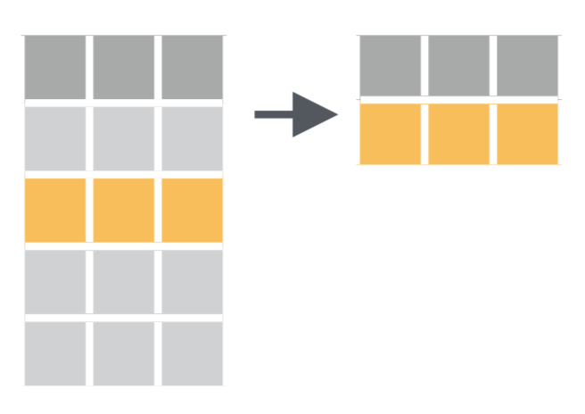

# Tripatouiller les données avec `dplyr` {#wrangling}

## Pré-requis 

Nous abordons ici une étape essentielle de toute analyse de données : la manipulation de tableaux, la sélection de lignes, de colonnes, la création de nouvelles variables, etc. Bien souvent, les données brutes que nous importons dans R ne sont pas utiles en l'état. Il nous faut parfois sélectionner seulement certaines lignes pour travailler sur une petite partie du jeu de données. Il nous faut parfois modifier des variables existantes (pour modifier les unités par exemple) ou en créer de nouvelles à partir des variables existantes. Nous avons aussi très souvent besoin de constituer des groupes et d'obtenir des statistiques descriptives pour chaque groupe (moyenne, écart-type, erreur type, etc). Nous verrons dans ce chapitre comment faire tout cela grâce au package `dplyr` qui fournit un cadre cohérent et des fonctions simples permettant d'effectuer tous les tripatouillages de données dont nous pourrons avoir besoin.

Dans ce chapitre, nous aurons besoin des packages suivants :
```{r}
library(dplyr)
library(ggplot2)
library(nycflights13)
```

```{r include=FALSE}
library(tidyverse)
```


## Le pipe `%>%`

Avant d'entrer dans le vif du sujet, je souhaite introduire ici la notion de "pipe" (prononcer à l'anglo-saxonne). Le pipe est un opérateur que nous avons déjà vu apparaître à plusieurs reprises dans les chapitres précédents sans expliquer son fonctionnement.

Le pipe, noté `%>%`, peut être obtenu en pressant les touches `ctrl + shift + M` de votre clavier. Il permet d'enchaîner logiquement des actions les unes à la suite des autres. Globalement, le pipe prend l'objet situé à sa gauche, et le transmet à la fonction situé à sa droite. En d'autres termes, les 2 expressions suivantes sont strictement équivalentes :

```{r eval = FALSE}
# Ici, "f" est une fonction quelconque, "x" et "y" sont 2 objets dont la fonction a besoin.

# Il s'agit d'un exemple fictif : ne tapez pas ceci dans votre script !
f(x, y)
x %>% f(y)
```


Travailler avec le pipe est très intéressant car toutes les fonctions de `dplyr` que nous allons décrire ensuite sont construites autour de la même syntaxe : on leur fournit un `data.frame` (ou encore mieux, un `tibble`), elles effectuent une opération et renvoient un nouveau `data.frame` (ou un nouveau `tibble`). Il est ainsi possible de créer des groupes de commandes cohérentes qui permettent, grâce à l'enchaînement d'étapes simples, d'aboutir à des résultats complexes.

De la même façon que le `+` permet d'ajouter une couche supplémentaire à un graphique `ggplot2`, le pipe `%>%` permet d'ajouter une opération supplémentaire dans un groupe de commandes.

Pour reprendre un exemple de la section \@ref(clouds) sur les nuages de points, nous avions commencé par créer un objet nommé `alaska_flights` à partir de l'objet `flights` :

```{r}
alaska_flights <- flights %>%
  filter(carrier == "AS")
```

Nous avions ensuite créé notre premier nuage de points avec ce code :

```{r tidy=FALSE, warning = FALSE, eval=FALSE}
ggplot(data = alaska_flights, mapping = aes(x = dep_delay, y = arr_delay)) + 
  geom_point()
```

Nous savons maintenant qu'il n'est pas indispensable de faire figurer le nom des arguments `data = ` et `mapping = `. Mais nous pouvons aller plus loin. En fait, il n'était même pas nécessaire de créer l'objet `alaska_flights` : nous aurions pu utiliser le pipe pour enchaîner les étapes suivantes :

1. On prend le tableau `flights`, *puis*
2. On filtre les données pour ne retenir que la compagnie aérienne `AS`, *puis*
3. On réalise le graphique

Voilà comment traduire cela avec le pipe :

```{r tidy=FALSE, warning = FALSE, fig.cap="Notre premier graphique, produit grâce au pipe"}
flights %>% 
  filter(carrier == "AS") %>% 
  ggplot(aes(x = dep_delay, y = arr_delay)) + 
    geom_point()
```

Notez bien qu'ici, aucun objet intermédiaire n'a été créé. Notez également que le premier argument du la fonction `ggplot()` a disparu : le pipe a fourni automatiquement à `ggplot()` les données générées au préalable (les données `flights` filtrées grâce à la fonction `filter`).

Comme pour le `+` de `ggplot2`, il est conseillé de placer un seul pipe par ligne, de le placer en fin de ligne et de revenir à la ligne pour préciser l'étape suivante.

Toutes les commandes que nous utiliserons à partir de maintenant reposeront sur le pipe puisqu'il permet de rendre le code plus lisible.


## Les verbes du tripatouillage de données

Nous allons ici nous concentrer sur les fonctions les plus courramment utilisées pour manipuler et résumer des données. Nous verrons 6 verbes principaux, chacun correspondant à une fonction précise de `dplyr`. Chaque section de ce chapitre sera consacrée à la présentation d'un example utilisant un ou plusieurs de ces verbes.

Les 5 verbes sont :

1. `filter()` : choisir des lignes dans un tableau à partir de conditions spécifiques (filtrer).
2. `arrange()` : trie les lignes d'un tableau selon un ou plusieurs critères (arranger).
3. `select()` : sélectionner des colonnes d'un tableau.
4. `mutate()` : créer de nouvelles variables en transformant et combinant des variables existantes (muter).
5. `summarise()` : calculer des résumés statistiques des données (résumer). Souvent utilisé en combinaison avec `group_by()`, qu permet de constituer des groupes au sein des données.
6. `join()` : associer, fusionner 2 `data.frame`s en faisant correspondre les éléments d'une colonne commune entre les 2 tableaux (joindre). Il y a beaucoup de fonctions permettant de joindre des tableaux de moult façons. Nous nous contenterons d'examiner les fonctions `left_join()` et `inner_join()`.

Toutes ces fonctions, tous ces verbes, sont utilisés de la mêma façon : on prend un `data.frame`, grâce au pipe, on le transmet à l'une de ces fonctions dont on précise les arguments entre parenthèse. Évidemment, on peut enchaîner les actions, c'est tout l'intérêt du pipe.

Enfin, gardez en tête qu'il existe beaucoup plus de fonctions dans `dplyr` que les 6 que nous allons détailler ici. Nous verrons parfois quelques variantes, mais globalement, maîtriser ces 6 fonctions simples devrait vous permettre de conduire une très large gamme de manipulations de données, et ainsi vous faciliter la vie pour la production de graphiques et l'analyse statistique de vos données.


## Filtrer des lignes avec `filter()`

### Principe

```{r, filterfig, echo = FALSE, out.width='50%', fig.align='center', fig.cap="Schéma de la fonction `filter()` tiré de la 'cheatsheet' de `dplyr` et `tidyr`"}

```

Comme son nom l'indique, `filter()` permet de filtrer des lignes en spécifiant un ou des critères de tri portant sur une ou plusieurs variables. Nous avons déjà utilisé cette fonction à plusieurs reprises pour créer les jeux de données `alaska_flights` et `small_weather` :

```{r tidy = FALSE, eval = FALSE}
alaska_flights <- flights %>% 
  filter(carrier == "AS")
```

```{r tidy = FALSE, eval = FALSE}
small_weather <- weather %>% 
  filter(origin == "EWR",
         month == 1,
         day <= 15)
```

Dans les 2 cas, la première ligne de code nous permet :

1. d'indiquer le nom du nouvel objet dans lequel les données seront stockées (`alaska_flights` et `small-weather`)
2. d'indiquer de quel objet les données doivent être extraites (`flights` et `weather`)
3. de passer cet objet à la fonction suivante avec un pipe `%>%`

Le premier argument de la fonction `filter()` doit être le nom d'un `data.frame` ou d'un `tibble`. Ici, puisque nous utilisons le pipe, il est inutile de spécifier cet argument : c'est ce qui est placé à gauche du pipe qui est utilisé comme premier argument de la fonction `filter()`. Les arguments suivants constitue le ou les conditions qui doivent être respectées par les lignes du tableau de départ afin d'être intégrées au nouveau tableau de données.

### Exercice

Dans la section \@ref(View), nous avons utilisé la fonction `View` et l'application manuelle de filtres pour déterminer combien de vols avaient quitté l'aéroport JFK le 12 février 2013. En utilisant la fonction `filter()`, créez un objet nommé `JFK_12fev` qui contiendra les données de ces vols.

```{r include=FALSE}
JFK_12fev <- flights %>% 
  filter(origin == "JFK",
         month == 2,
         day == 12)
JFK_12fev
```

Vérifiez que cet objet contient bien `r nrow(JFK_12fev)` lignes.

### Les conditions logiques

Dans la section \@ref(comparaison), nous avons présenté en détail le fonctionnement des opérateurs de comparaison dans R. Relisez cette section si vous ne savez plus de quoi il s'agit. Les opérateurs de comparaison permettent de vérifier l'égalité ou l'inégalité entre des éléments. Ils renvoie `TRUE` ou `FALSE` et seront particulièrement utiles pour filtrer des lignes dans un tableau. Comme indiqué dans la section \@ref(comparaison), voici la liste des opérateurs de comparaison usuels :

* `==` : égale à
* `!=` : différent de
* `>` : supérieur à
* `<` : inférieur à
* `>=` : supérieur ou égal à
* `<=` : inférieur ou égal à

À cette liste, nous pouvons ajouter quelques éléments utiles :

* `is.na()` : renvoie `TRUE` contient des données manquantes.
* `!` : permet de tester le contraire. Par exemple `!is.na()` renvoie la liste de ce qui ne contient pas de données manquantes.
* `%in%` : permet de tester si l'élément de gauche est contenu dans la série d'éléments fournie à droite. Par exemple `2 %in% 1:5` renvoie `TRUE`, mais `2 %in% 5:10` renvoie `FALSE`.
* `|` : opérateur logique `OU`. Permet de tester qu'une condition `OU` une autre est remplie.
* `&` : opérateur logique `ET`. Permet de tester qu'une condition `ET` une autre sont remplies.

Voyons comment utiliser ces opérateurs avec la fonction `filter()`.

Dans le tableau `flights`, tous les vols prévus ont-ils effectivement décolé ? Une bonne façon de le savoir est de regarder si, pour la variable `dep_time` (heure de décollage), des données manquantes sont présentes :

```{r, tidy=FALSE}
flights %>% 
  filter(is.na(dep_time))
```

Il y a donc `r nycflights13::flights %>% filter(is.na(dep_time)) %>% nrow()` vols qui n'ont pas décollé. Dans le même ordre d'idée, y a t-il des vols qui ont décollé mais qui ne sont pas arrivés à destination ? Là encore, une façon d'obtenir cette information est de sélectionner les vols qui ont décollé (donc pour lesquels l'heure de décollage n'est pas manquante), mais pour lesquels l'heure d'atterrissage est manquante :

```{r, tidy=FALSE}
flights %>% 
  filter(!is.na(dep_time),
         is.na(arr_time))
```

Notez l'utilisation du `!` pour la première condition. Cette syntaxe est équivalente à :

```{r, tidy=FALSE}
flights %>% 
  filter(!is.na(dep_time) & is.na(arr_time))
```

Dans la fonction `filter()`, séparer plusieurs conditions par des virgules signifie que seules les lignes qui remplissent toutes les conditions seront retenue. C'est donc l'équivalent du `ET` logique.

Il y a donc `r nycflights13::flights %>% filter(!is.na(dep_time) & is.na(arr_time)) %>% nrow()` vols qui ne sont pas arrivés à destination (soit moins de 0,2% des vols au départ de New York en 2013). Selon vous, quelles peuvent en être les raisons ?


## Trier des lignes avec `arrange()`


## Sélectionner des variables avec `select()`


## Créer de nouvelles variables avec `mutate()`


## Créer des résumés avec `summarise()` et `group_by()`

```{r, tidy=FALSE}
cancelled <- flights %>% 
  filter(!is.na(dep_time),
         is.na(arr_time)) %>% 
  count(carrier)
cancelled
```

## Associer plusieurs tableaux avec `left_join()` et `inner_join()`

<!-- ```{r, tidy=FALSE} -->
<!-- all_flights <- flights %>%  -->
<!--   count(carrier) -->
<!-- all_flights -->

<!-- left_join(all_flights, cancelled, by = "carrier") -->
<!-- inner_join(all_flights, cancelled, by = "carrier") -->
<!-- inner_join(all_flights, cancelled, by = "carrier") %>%  -->
<!--   mutate(pc = n.y * 100 / n.x) %>%  -->
<!--   arrange(desc(pc)) -->

<!-- left_join(all_flights, cancelled, by = "carrier") %>%  -->
<!--   mutate(pc = n.y * 100 / n.x) %>%  -->
<!--   arrange(desc(pc)) -->

<!-- left_join(all_flights, cancelled, by = "carrier") %>%  -->
<!--   mutate(pc = n.y * 100 / n.x) %>%  -->
<!--   ggplot(aes(x = fct_reorder(carrier, pc, .desc = TRUE), y = pc)) + -->
<!--     geom_col() + -->
<!--     labs(x = "Compagnie aérienne", -->
<!--          y = "Proportion de vols annulés après décollage (%)") -->


<!-- cancelled_origin <- flights %>%  -->
<!--   filter(!is.na(dep_time), -->
<!--          is.na(arr_time)) %>%  -->
<!--   count(carrier, origin) -->
<!-- cancelled_origin -->

<!-- all_flights_origin <- flights %>%  -->
<!--   count(carrier, origin) -->
<!-- all_flights_origin -->

<!-- left_join(all_flights_origin, cancelled_origin, by = c("carrier", "origin")) %>%  -->
<!--   mutate(pc = n.y * 100 / n.x) %>%  -->
<!--   ggplot(aes(x = fct_reorder(carrier, pc, .desc = TRUE), y = pc, fill = origin)) + -->
<!--     geom_col(color = "black") + -->
<!--     facet_wrap(~origin, ncol = 1) + -->
<!--     labs(x = "Compagnie aérienne", -->
<!--          y = "Proportion de vols annulés après décollage (%)", -->
<!--          fill = "Aéroport de\nNew York") + -->
<!--     scale_fill_brewer(palette = "Set1") -->

<!-- ``` -->


<!-- barres d'erreur -->
<!-- Vols de JFK du 12 février -->

<!-- Diamonds trop gros à la fac -->